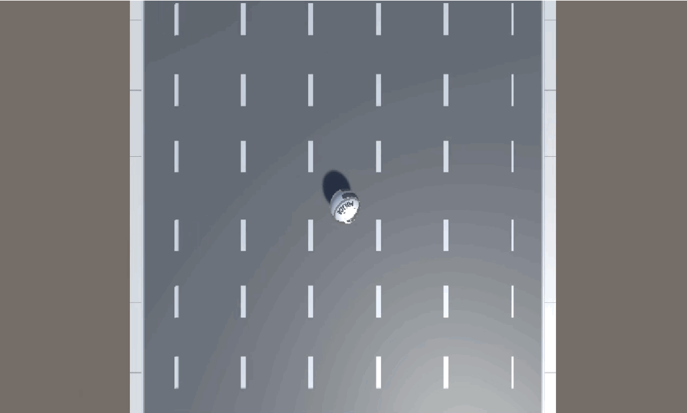
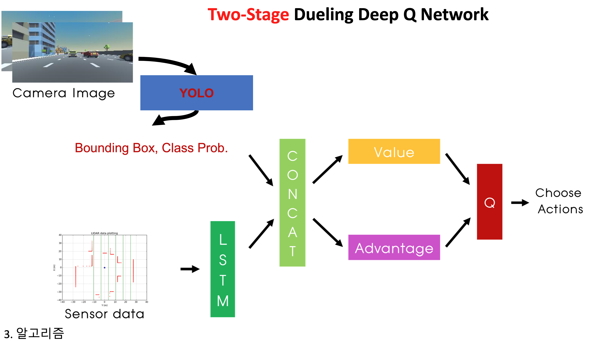
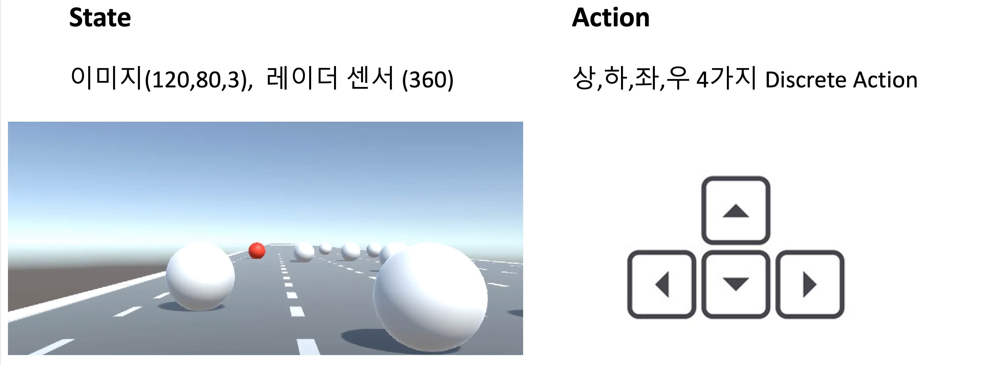
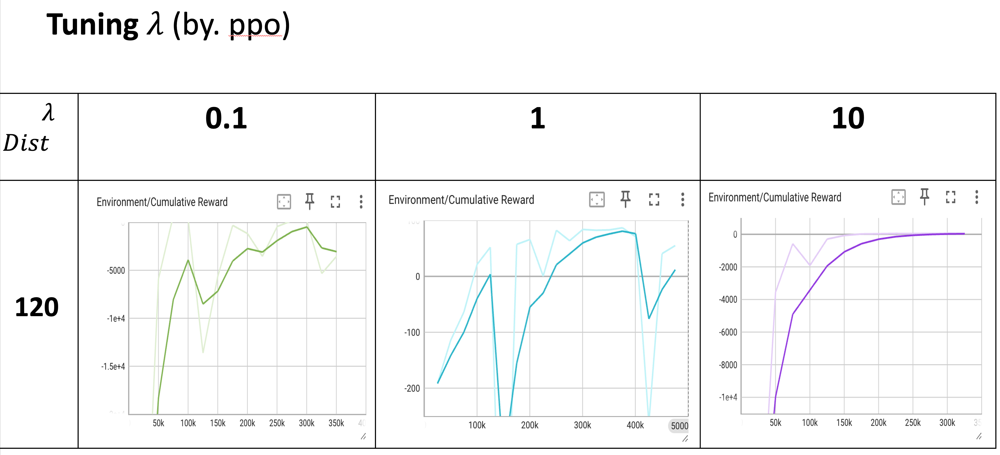
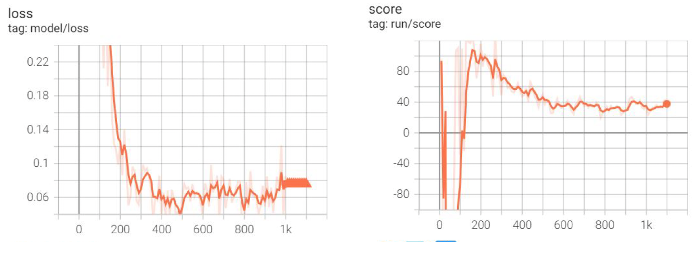
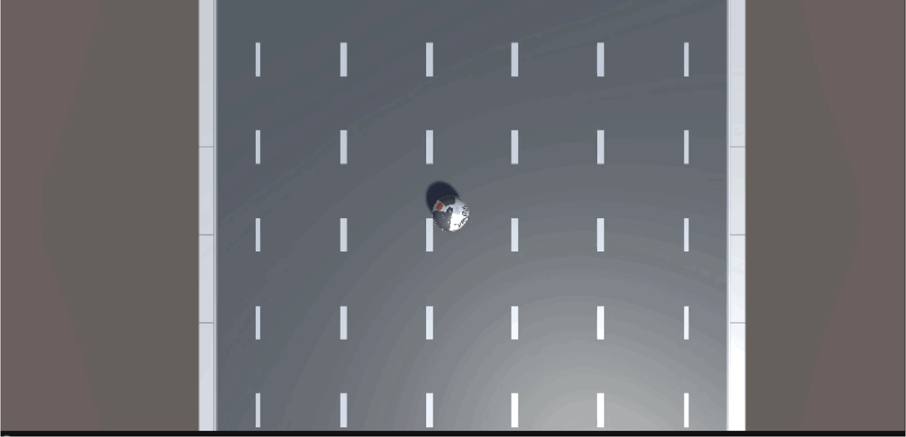

# PPO를 이용한 RollerBall 게임 학습 프로젝트

## 🎮 프로젝트 소개

이 프로젝트는 Unity ML-Agents를 사용하여 강화학습 알고리즘 중 하나인 PPO(Proximal Policy Optimization)를 통해 RollerBall 게임 에이전트를 학습시키는 것을 목표로 합니다. 에이전트는 공을 조종하여 맵 위에 있는 타겟을 수집하고, 맵 밖으로 떨어지지 않도록 학습합니다.

### 게임 소개

## 🚀 개발 환경

*   Unity ML-Agents
*   PyTorch
*   Python 3.x

## ⚙️ 모델 아키텍처 및 하이퍼파라미터

### 모델 아키텍처

학습에 사용된 모델의 아키텍처는 아래와 같습니다.

### 상태 및 행동 공간

*   **상태 공간 (State Space):** 공의 위치, 회전, 속도 등 8개의 변수로 구성됩니다.
*   **행동 공간 (Action Space):** x축과 z축 방향으로 공에 가할 힘을 나타내는 2개의 연속적인 값으로 구성됩니다.

### 하이퍼파라미터 튜닝 결과

최적의 학습을 위해 하이퍼파라미터 튜닝을 진행했으며, 그 결과는 다음과 같습니다.

## 📊 학습 결과

### 보상 및 손실 그래프

학습이 진행됨에 따라 에이전트가 받는 보상과 손실 함수의 변화는 아래 그래프와 같습니다.

## 🤖 학습된 에이전트 플레이

학습이 완료된 에이전트가 실제로 게임을 플레이하는 모습입니다.

